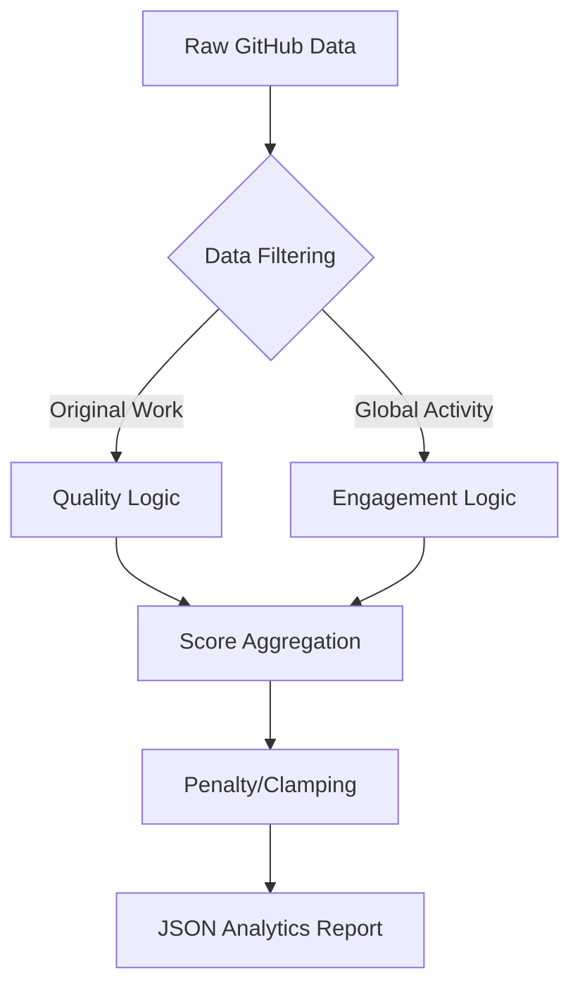

# Portfolio Scoring Engine: Technical Architecture

This document details the "Under the Hood" implementation of the **Custom Algorithmic Scoring Engine** used in this project. It is designed to act as an automated technical auditor, simulating the decision-making process of a Senior Engineering Manager.

---

## 🏗️ System Architecture

The scoring engine is a self-contained logic module implemented in **JavaScript (Node.js)**. It follows a functional programming pattern where raw data is piped into an analyzer and results in a structured JSON report.

### 1. Data Ingestion Layer
The engine depends on three primary data streams provided by the `githubService.js` module:
- **User Object**: Basic profile metadata (Bio, Followers, Repo count).
- **Repos Array**: Full metadata for all public repositories (Stars, Forks, Languages, Topics, Timestamps).
- **Events Array**: A history of the user's last 100 activities (PushEvents, PullRequestEvents, IssueComments).

### 2. Analysis Pipeline
The `calculateScore()` function in `scoreEngine.js` processes data through a multi-stage pipeline:



---

## 🧠 Core Algorithmic Components

### A. Heuristic Content Analysis
Instead of just counting repos, the engine uses **Regular Expressions (Regex)** and **Keyword Extraction** to understand the "Intent" of the projects.
- **Role Detection**: Scans names/descriptions for keywords (e.g., `react` → Frontend, `docker` → DevOps).
- **Technical Rigor**: A custom lookup table of "Low-Level" languages (Rust, C++, etc.) triggers a difficulty multiplier.

### B. Impact Density Logic (v5.0)
We use a **Star-to-Fork Ratio** to detect organic growth.
- **Logic**: `Stars / Forks < 10` is considered a "Healthy Utility" signal. 
- **Internal Reality**: If a project has 100 stars but 0 forks, it is flagged as low-engagement. If it has 10 forks, it means 10 other developers are actually working on the code.

### C. Pattern-Based Activity Scanning
The engine audits **PushEvent payloads** to identify professional discipline:
- **Conventional Commits**: It matches commit messages against the regex `/^(feat|fix|docs|style|refactor|perf|test|build|ci|chore|revert):/`. 
- **Professionalism Signal**: High usage of these prefixes awards points for "DevOps Culture."

### D. Security Hygiene Audit
The engine performs a "Safety Scan" on public metadata:
- **Risk Detection**: Searches for substrings like `.env`, `secret`, `credential`, or `token`.
- **Logic**: An automated "Red Flag" system that subtracts points to encourage better security practices.

---

## ⚖️ Weighting & Normalization

The score is calculated as a **Weighted Moving Average** across several categories. Points are distributed to ensure a balanced profile:
- **Hygiene (20%)**: Accessibility and branding.
- **Documentation (35%)**: Readability and presentation.
- **Community (30%)**: Collaboration and open-source impact.
- **Complexity (15%)**: Technical depth and rigors.

### The "Clamping" Function
To maintain a clean user interface, the final engine output is passed through a **Normalization Clamper**:
```javascript
score = Math.max(0, Math.min(Math.round(score), 100));
```
This ensures the score stays within the 0-100 range regardless of individual category over-performance.

---

## 🛡️ Design Philosophy
The engine ignores "Vanity Metrics" (like large numbers of empty repositories or unoriginal forks) and prioritizes **originality, documentation quality, and collaborative consistency**.

*File Source: `backend/scoreEngine.js`*
